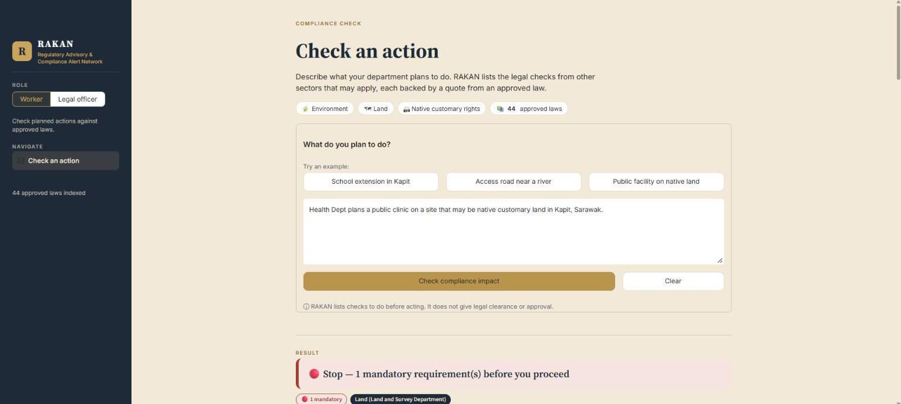
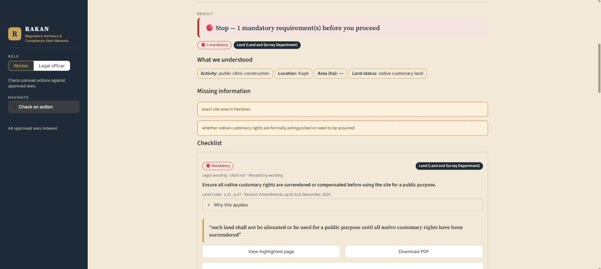
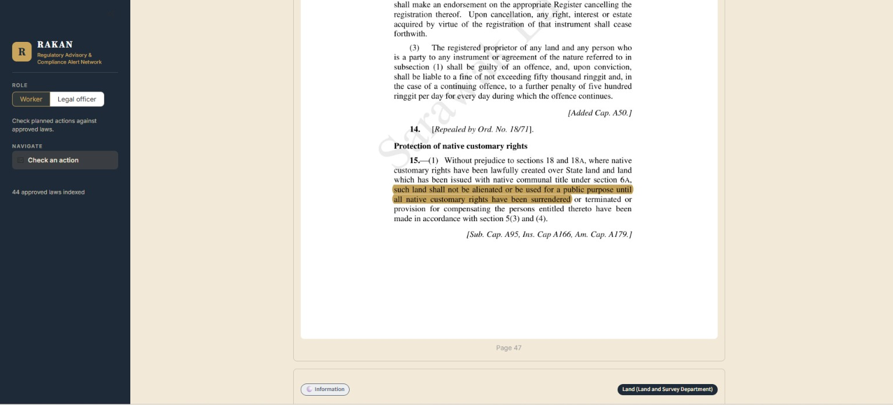

# Compliance Impact Alert

**Team Name:** 404

**Team Members:**
1. Sharlene Lim
2. Ngui Jia Yi
3. Liew Mei Qi
4. Stefani Lee

---

## About the Project

RAKAN (Regulatory Advisory & Compliance Alert Network) helps government sector workers quickly check whether a planned action (e.g. construction, land clearing, procurement) triggers legal or regulatory requirements from laws outside their own department — before they proceed.

Instead of providing a generic "yes/no" answer, RAKAN generates a Compliance Impact Alert: a conditions-first checklist built from verified, citable sources, so no answer is based on a bare approval or an invented legal claim.

The name RAKAN reflects the system's role as a regulatory support tool for government officers, helping them identify, understand, and verify compliance requirements before taking action.

### Key Features

- **Plain-language action check** — a worker describes a planned action in free text and
  receives a compliance alert within seconds, along with any missing facts needed for a
  complete answer (e.g. site area, land status).
- **Conditions-first answers** — the headline (🔴 Stop / 🟡 Allowed with conditions / ⚪ No
  requirements found) is generated from verified rules in code, never from raw LLM text.
- **Verified, highlighted citations** — every condition carries a verbatim quote from the
  actual law PDF, checked against the source document and linked to the exact highlighted
  page.
- **Severity from legal wording** — conditions are flagged 🔴/🟡/⚪ based on the strength of
  the legal language itself (e.g. "shall" vs "may"), using an editable rules table.
- **Human-in-the-loop legal review** — a Legal Officer uploads and curates all laws, trigger
  mappings, and new versions. Nothing becomes searchable by workers until it's approved.
- **Version tracking & stale warnings** — when a law is updated, workers are warned if an
  answer cites a version that's pending review, and section-level diffs are shown to the
  Legal Officer before approval.

### How It Works

1. A worker submits a planned action in plain text.
2. The system extracts key facts and activity tags, then retrieves relevant law sections
   using a structure-aware (vectorless) approach: a curated trigger map, table-of-contents
   navigation, a keyword safety net, and one-hop cross-references — all restricted to
   **Legal-Officer-approved** law versions.
3. Candidate sections are turned into draft conditions with verbatim quotes.
4. Each quote is verified against the actual PDF; unverified claims are dropped.
5. Severity is assigned from fixed rules on the verified legal wording.
6. The worker sees a checklist with citations linking straight to the highlighted PDF page.

### Tech Stack

- **Backend:** Local Python + a direct LLM API (`llm.py`, provider-agnostic)
- **Retrieval:** Structure-aware (vectorless) RAG — trigger map + table-of-contents
  navigation + BM25 keyword safety net + cross-reference following (no embeddings, no
  vector database)
- **PDF handling:** PyMuPDF — text extraction, page mapping, quote verification, and
  highlight annotations
- **Storage:** SQLite + files on disk
- **UI:** Streamlit, with separate Worker and Legal Officer tabs

### Scope

This is a hackathon prototype focused on demonstrating verified, conditions-first compliance
checking for a small curated set of Sarawak/federal laws. It does not cover case law, advice
for the public, automatic consolidation of amendments, gazette parsing, real authentication,
or complete legal coverage.

---

## Screenshots

**Check an action (Worker tab)** — a worker describes a planned action in plain text.



**Result: Compliance Impact Alert** — a conditions-first checklist with missing facts, severity badges, and a verified quote linking to the source law.



**Verified citation on the source PDF** — the exact quote highlighted on the actual law page.



---

## Getting Started

Python 3.12, from the repo root (PowerShell):
```powershell
py -3.12 -m venv .venv
.\.venv\Scripts\python -m pip install -r requirements-dev.txt
copy .streamlit\secrets.toml.example .streamlit\secrets.toml   # then paste the Gemini key (ask Jy; never commit it)
.\.venv\Scripts\python -m streamlit run streamlit_app.py
.\.venv\Scripts\python -m pytest -q                              # backend tests, offline (fake LLM)
```
Streamlit Cloud: main file `streamlit_app.py`, Python 3.12, and paste the contents of `secrets.toml` into App settings → Secrets.

---

## Backend (`services/`): status and how to plug it in

**Status:** built and tested. 23 offline tests pass. A live run with Gemini on the full `Law/` dataset passed
10 of 12 evaluation cases on the first try, at about 4–8 s per check, and the two misses were then explained.
Run it yourself with `python -m scripts.eval`.

**Plug in:** in `ui/backend.py` set `USE_MOCK = False`. It imports `check_action, upload_preview, submit_upload,
list_pending, approve, reject, list_triggers, propose_trigger, list_laws, get_audit_log, render_highlight` (plus
`health` and `ServiceError`) from `services`, with the same names and keys as the frontend contract.

Notes for the UI (nothing in the contract changes):
- **The first call after a (re)start builds the law library (~20 s locally).** Call `services.health()` once inside `@st.cache_resource` with a spinner, e.g. "Loading law library…".
- `check_action` takes ~3–10 s, so call it only on the button press and keep the result in `st.session_state`.
- Pages are **1-based**. Use `services.render_highlight(pdf_path, page, highlight_rects)` for the highlighted page image.
- `list_pending()` ids are unique across types (trigger rules use 1,000,000+), so `approve(id, note)` works for all of them.
  Optional: `approve(id, note, reviewer="name")` and `propose_trigger(..., severity_override="red", proposed_by="name")` put real names in the audit log.
- Errors are raised as `ServiceError`; show `str(e)`.
- Extra keys you may show: `dropped_unverified` ("1 unverified claim removed"), `source_authority == "unofficial"` (a Malay *translation*), `amend_notes`, `language`, and `llm_provider == "fake"` (Replay mode).
- A question in Bahasa Melayu gets a Malay headline and requirements. Quotes stay in the law's own language.

**Knowledge base:** all 44 PDFs in `Law/` (Bahasa Melayu and English), plus the NREO in `Law/Sarawak Environment Law/`
for the waste-facility demo. English and Malay versions of the same Act are grouped, so an answer cites one of them,
in the question's language. Titles and version dates come from inside each PDF (see `services/catalog/laws.json`).
- `LAWS OF SARAWAK.pdf` is really the *Native Customary Marriages (Maintenance) Ordinance 2003*.
- `LAND USE ORDINANCE.pdf` is the *Land Use (Control of Prescribed Trading Activities) Ordinance*.
- **Check these before relying on them:** the English Federal Constitution PDF is only "as at 1 Nov 2010", and BAFIA 1989 may have been repealed by the Financial Services Act 2013. Their version labels say so.
- To add a law permanently, drop the PDF into `Law/<Malaysia|Sarawak> <Category> Law/`, run `python -m scripts.build_catalog`, and commit `services/catalog/laws.json`. In the app, the legal officer can also upload it; it stays **pending until approved**.
- Uploaded meeting minutes, circulars or guidelines (`instrument_type` in the upload meta) are internal documents. They can produce 🟡 but never 🔴.
